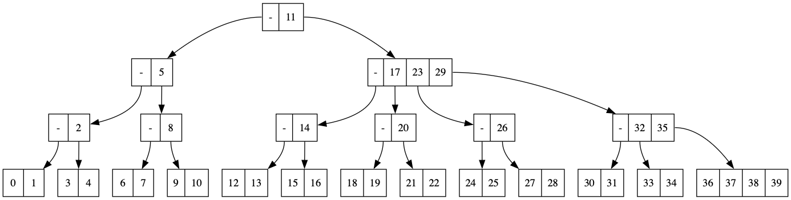

# A Btree Index Storage Engine


A Btree Index Storage Engine is a simple storage engine that uses a Btree to store data. It is a simple implementation of a Btree that can be used to store data.


* Using C++20

* support:
    - MacOS
    - Linux

* feature:
    - \[Graphviz\]: generate btree structure into a dot file (default directory is ./dots)
        - Example:
            
        - Visualize it In [Graphviz Online](https://www.google.com/url?sa=t&source=web&rct=j&opi=89978449&url=https://dreampuf.github.io/GraphvizOnline/&ved=2ahUKEwi5-eC9pIiNAxXJmYkEHUQgBiUQFnoECAoQAQ&usg=AOvVaw2Sw6OnaIb_oZkOtu44VcNz)
# Build & Run:

```c++
    ./build.sh
```
